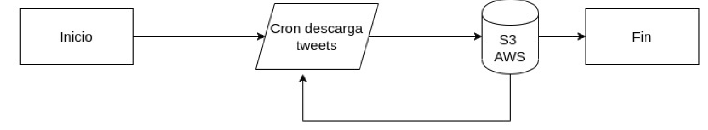
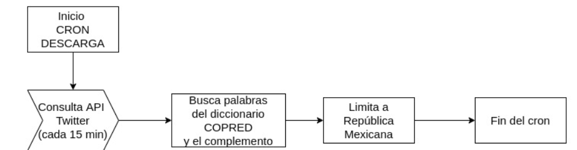
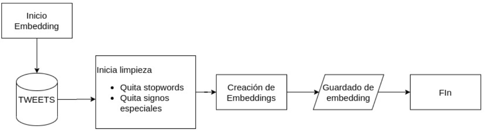
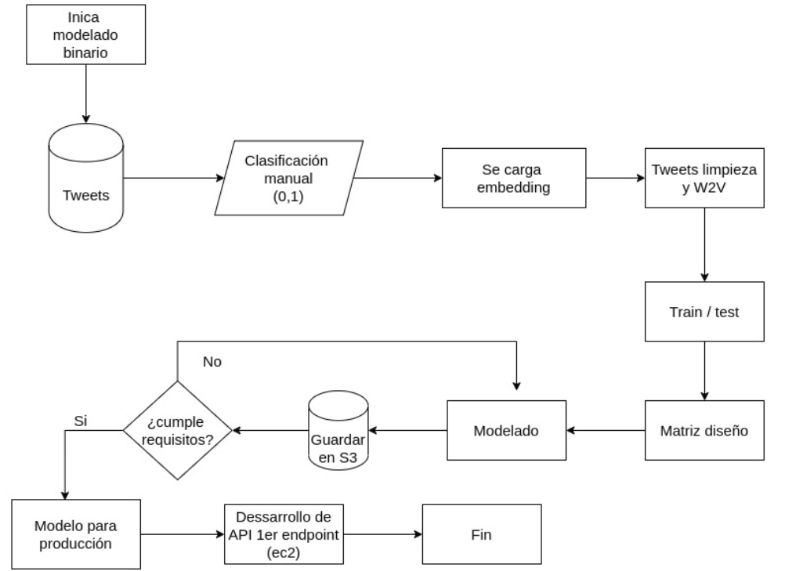
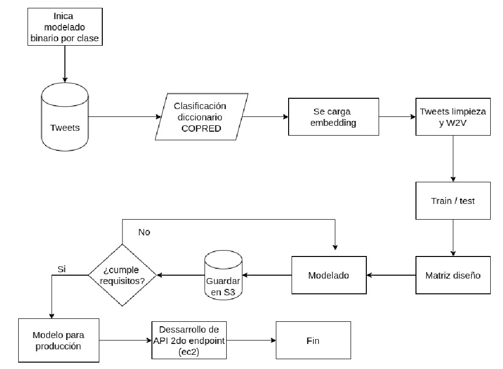
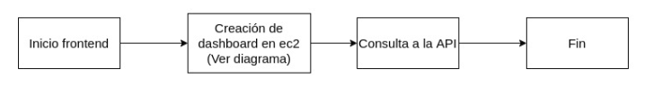

## Iteración dos del proyecto discriminamometro.

_______________

### 1. Proyecto
_______________

Este proyecto realiza una segunda iteración para el modelado de discriminación en twitter y pretende ser un motor complementario a las ONG's para la prevención.

En esta iteración se dividió el problema en dos grandes preguntas:
1. ¿Un tweet es discriminatorio ó no?
2. ¿A qué tipo de discriminación pertenece segun el [diccionario](https://camo.githubusercontent.com/4201aace5778730e3329ced0baed0e2bb3910fe0/68747470733a2f2f692e696d6775722e636f6d2f653573645161502e706e67) de COPRED?

La lógica bajo la cual fué realizado es la siguiente.

#### 1.1 Obtención de datos
Se creó un cron encargado de descargar tweets y depositarlos en un bucket de s3



Los tweets son descargados cada 15 minutos basado en el [diccionario](https://camo.githubusercontent.com/4201aace5778730e3329ced0baed0e2bb3910fe0/68747470733a2f2f692e696d6775722e636f6d2f653573645161502e706e67) definido por COPRED y limitandos a la República Mexicana



#### 1.2 Modelado

1.2.1 Se realizaron embeddings con un aproximado de 3,000,000 de tweets ejemplos excluyendo nombres propios, signos especiales y stopwords. Estos embeddings son guardados para utilizar en el modelado.


1.2.2 Para responder la primer pregunta, se considero un modelo de clasificación binaria. Los tweets se categorizaron de manera manual por SocialTic, y una vez que se obtuvo la variable target se desarrollo el modelo de la siguiente forma.


1.2.3 Para el modelado de categoria, se consideró un clasificador binario para cada una de las 7 clases.


#### 1.3 Frontend producto

Una vez obtenidos los modelos, se desarrolló una API a travez de la cual se van mandar llamar. Un dashboard apoyara a la visualización del semaforo de discriminación y tendra los siguientes pasos.

_______________

### 2. Reproducibilidad
_______________

El desarrollo de este producto de datos, se puede replicar usando anaconda y utilzando el archivo **environment.yml**, el cual contiene todos los paquetes y versiones utilizadas. Para crear el ambiente solo es necesario usar el siguiente comando

```
conda env create -f environment.yml
```
Y activarlo
```
conda activate discriminamometro
```

Además en el archivo **requirements.txt** se enlistan todos los paquetes y versiones. Estos fueron utilizados bajo la versión de **python 3.7.6**
